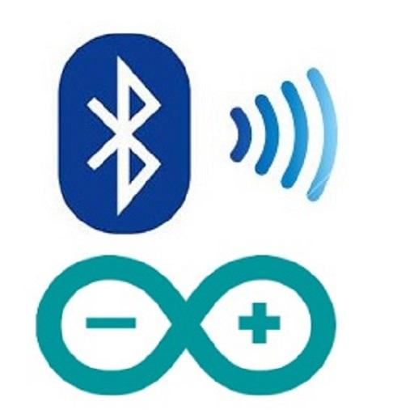
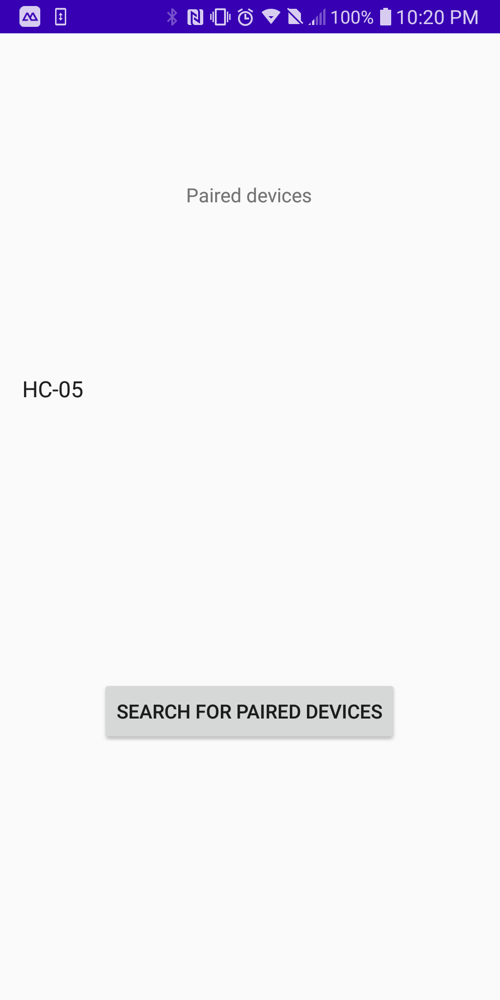
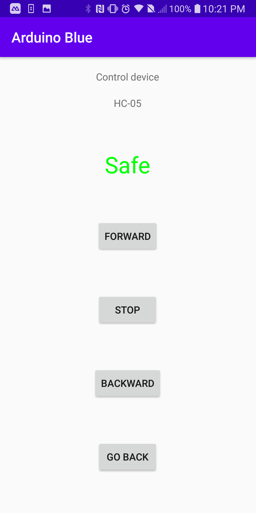
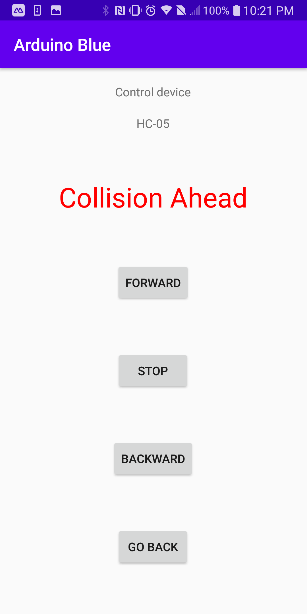

# Arudino Bluetooth  

## Introduction
 
 This a school projects that I made to control an Arduino Uno board using Bluetooth using an Android phone. This app will list all the  bluetooth paired devices. Once the user selects one, there will be a list of commands that can be sent to the Arduino. The Arduino Uno unit will send and receive data using a HC-05 bluetooth module. There is an ultrasonic sensor which will detected an imminent collision, if any, the arduno will take controll, backup the model using the 4 rotors

## Required 

1. [Android Studio IDE and SDK](http://developer.android.com/sdk/index.html)
2. HC-05 bluetooth module
3. Arudino Uno 
4. A few breadboard wires to connect
5. Ultrasonic sensor
6. 4 DC-rotor

## Setup

1. Clone this repo and open it inside of Android Studio.
2. Build the app
3. Install the app to your connected Android phone.
4. [Upload this code on Arudino](https://github.com/claudioMiraka/ArduinoBluetooth/blob/master/arduino%20bluetooth/arduino_blue/arduino_blue.ino)

## Screens

 

 

 

</p?
